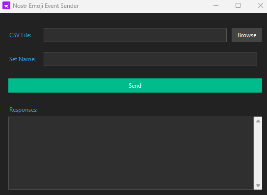

# Nostr Emoji Pack Sender

Nostr Emoji Pack Sender is a simple GUI application that allows you to create and send Nostr emoji packs from a CSV file to specified relays.

## Features

- User-friendly GUI built with ttkbootstrap
- Import emoji data from CSV files
- Specify custom set names for your emoji packs
- Send emoji packs to multiple Nostr relays
- Dark theme for comfortable use

## Installation

1. Download the latest [release](https://github.com/0ceanSlim/nostpy_emoji/releases//#latest)

## Usage

1. Copy the example configuration file:

`cp config.example.yml config.yml`

2. Edit `config.yml` and input your Nostr private key and the relays you want to use.

3. Run the program

4. Use the GUI to select your CSV file, enter a set name, and send your emoji pack.

## CSV Format

Your CSV file should have the following format:

example,example.png  
smiley,smiley.png

### License

This project is Open Source and licensed under the MIT License. See the [LICENSE](license) file for details.

### Acknowledgments

Special thanks to the Nostr community for their continuous support and contributions.

Feel free to reach out with any questions or issues you encounter while using this app.

Open Source and made with 💦 by [OceanSlim](https://njump.me/npub1zmc6qyqdfnllhnzzxr5wpepfpnzcf8q6m3jdveflmgruqvd3qa9sjv7f60)
